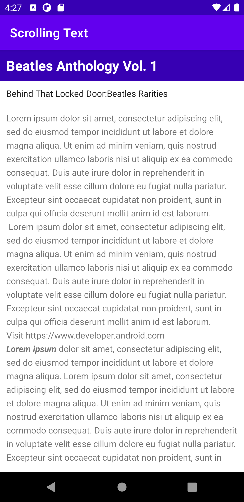
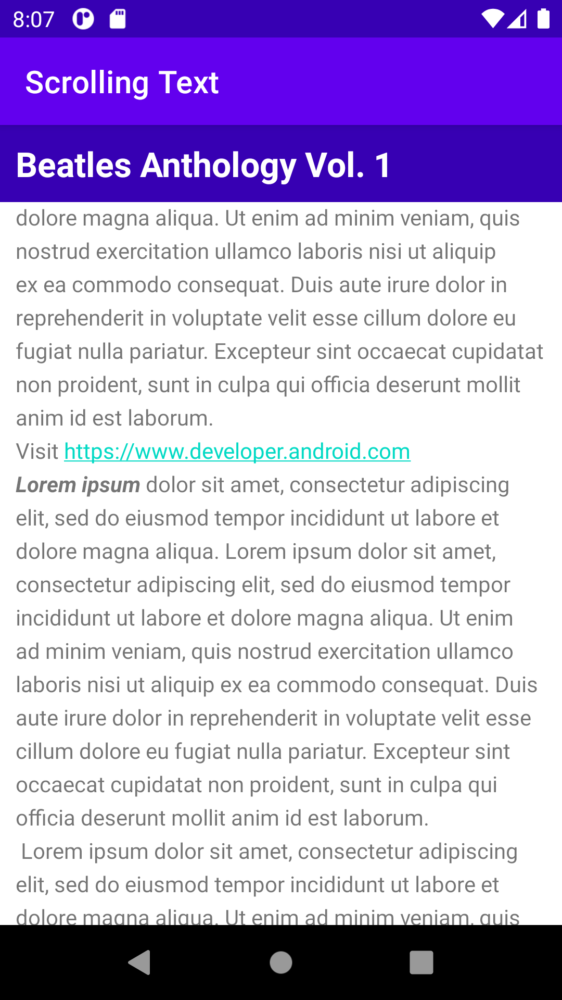
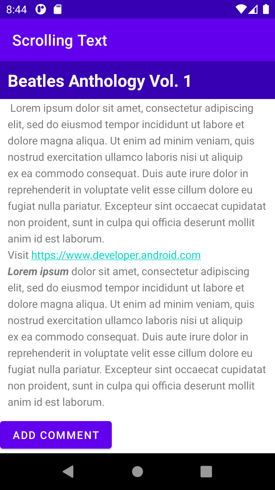
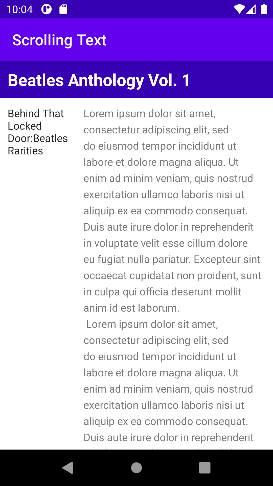

# text-and-scrolling-views
<b>Task 1</b>
 

 
<b>Task 2</b>
 
No scroll view
 

 
Scroll view
 

 
<b>Task 3</b>
 
<b>Scrolled up sub heading</b>
 

 
<b>Coding Challenge</b>
 
Comment Button
 

 
<b>Homework</b>
 

